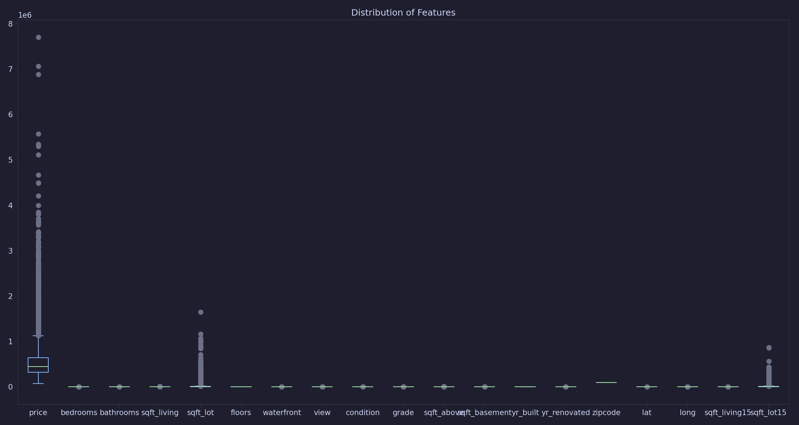
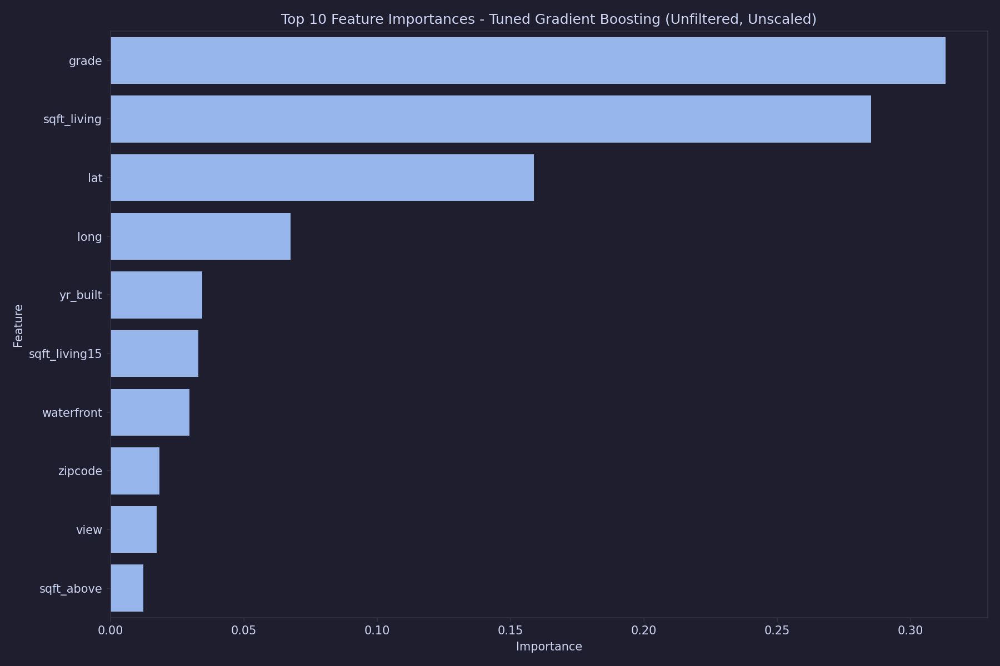

# House Price Prediction in King County

### Using Machine Learning

---

## Project Overview

- **Objective**: Build an accurate model to predict house prices in King County, USA
- **Dataset**: 21,613 records with 20 features describing residential homes
- **Target Variable**: House price
- **Methodology**: Comprehensive ML pipeline with multiple model types and feature engineering

---

## Data Exploration

- **Shape**: (21,613, 20)
- **Target variable**: price
- **Key features**: sqft_living, grade, bathrooms, view, lat, long, etc.
- **No missing values** in the dataset
- **Highly correlated features**: sqft_living and sqft_above (0.876) - handled by removing one

---

## Feature distribution

---

## Feature Engineering & Selection

### Key Steps:
- Created new feature: `is_renovated` (yr_renovated > 2005)
- Removed `date` column (post dates, single year only)
- *Handled multicollinearity*: Removed features with correlation > 0.8
- *Feature selection*: Removed low-correlation features (< 0.2 with target)

### Most important features identified:
- sqft_living (0.70 correlation with price)
- grade (0.67 correlation with price)
- sqft_above (0.61 correlation with price)

---

## Model Comparison Results

| Model | R² Score | MSE |
|-------|----------|-----|
| **Tuned Gradient Boosting (Unfiltered, Unscaled)** | **0.8836** | **1.74e+10** |
| Tuned XGBoost (Unfiltered, Unscaled) | 0.8792 | 1.81e+10 |
| XGBoost (Unfiltered, Unscaled) | 0.8685 | 1.97e+10 |
| Tuned Random Forest (Unfiltered, Unscaled) | 0.8684 | 1.97e+10 |
| Random Forest (Unfiltered, Unscaled) | 0.8670 | 1.99e+10 |

- **Best performing model**: Tuned Gradient Boosting
- **Performance improvement**: ~18% better than baseline models

---

## Feature Importance Analysis

---

## Key Conclusions & Insights

### Top Performers:
- **Gradient Boosting** consistently outperformed other models
- **Feature selection** significantly improved model performance
- **Hyperparameter tuning** added 1-2% improvement in R² score

### Business Insights:
- Location is a significant factor in pricing
- House size and quality grade are critical
- Age of the house affects value while renovation date not that much

---

## Next Steps:

- Consider ensemble of top models
- Explore additional feature engineering
- Investigate external factors (schools, crime rates, etc.)
- Gather more data to extract temporal dynamics
